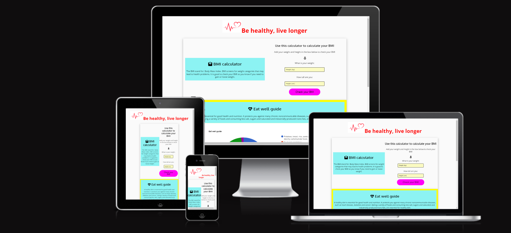
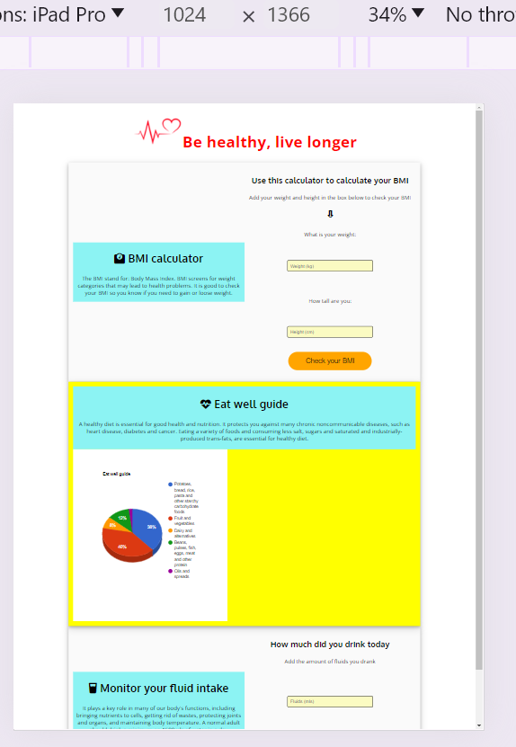
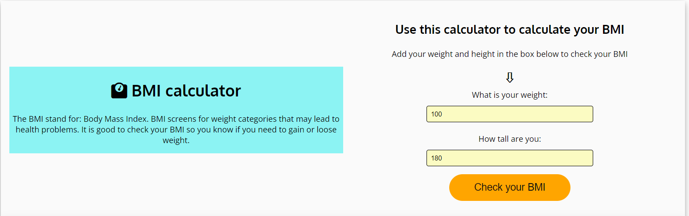

# Be healthy

[Link to a live site](https://pauldmnn.github.io/Be-healthy-project/)

## Introduction

Welcome to my second project which is part of the Code Institute Full Stack Development Course. The purpose of this project is to build an interactive front-end site which will respond to the users actions and allowing the user to input data and see the result.  

In this project the user can check what their Body Mass Index is and they can track the amount of fluids they drank.

The user will be able to input their weight and height and the site will calculate their BMI and will open a popup window in which the user will see their BMI categoy. There is a fluid input box which will allow the user to input the amount of fluide they drank and will strore the result so the user can easly track the amount of fluids they drank. 

#### Thank you for using this calculator

## UX - User Experience Design

In the course I was taught about the User Experience Design and the importance of it. 
Below I have listed the 5 plains of UX: 

- The Strategy Plane
- The Scope Plane
- The Structure Plane
- The Skeleton Plane
- The Surface Plane

## The Strategy Plane

### Creator Goals

- I want webpage to be easy to navigate.
- I want webpage to be a user-friendly and responsive.
- I want users to be able to see what the site is about immidiately.

### User Stories

- As a user, I want the purpose of a webpage to be clear so I can decide if the content is right for me.
- As a user, I want to be able to calculate my BIM by inputing mu weight and height
- As a user, I want to monitor my fluid intake so I know if i am hydrated 

## The Scope Plane

I thought of the features I wanted to implement before designing the project, and a few of them were not achievable within my deadline. I decided to implement the ones covering my user stories first and add the remaining features later.

**Features implemented upon webpage release**

- The site to have an explanation to why is it important to have a normal body weight.
- Underneath the BMI calculator to have a fluid calculator so the user can imput the amount of fluids they drank and show them the total amount they have drank. 
- The BMI calculator button to automaticly change colors wich will make the user drawn to click the button
- The result for the BMI to be in a popup window

## The Scope Plane

### Colors

rgb(227, 224, 224):
- BMI container background 

red:
- Header text

#fafafa :
- Fluids text button

azure :
- BMI calculator background 
- Monitor your fluid intake background

rgb(40, 215, 254):
- Fluids container background

Yellow:
- Popup background

### Fonts

Both fonts used in this project are Google Fonts.

#### Oxygen :
I used Oxygen as the main font, as it's one of the most popular and user-friendly fonts. The Oxygen font is easy to read even on the smallest devices and provides a positive user experience.

#### Open Sans:
Open Sans font has been used for the headings. Using a different font for these features helped me highlight important sections to user and made the website easier and quicker to navigate.

## The Skeleton Plane

I made some some changes to my project. Some features have become unnecessary or have caused poor user experience, so I decided to make them user friendly.

- The information about BMI and hydration was hard to be distingushed so i added a different color background so the user can read easyer the information

- The text color for the BMI button was hard to read because of the color blinking so i changed the text color 

## The Surface Plane

### Features present across the project 

### Calculate BMI section :

- The calculator is responsive for all devices
- The the input box is only for numbers

**Desktop** : 

**Tablet**

**Mobile** :

### BMI Calculator

    - Tells the user about importance of having a norma body weight and the user can calculate their onw BMI

### Fluids

    - Tells the user about the importance of keeping hydrated and then the user can input the amout of fluids they drank and every time they add more fluids the total will be added.

## Testing

### Manual testing

- Full page :
    - The page is fully responsive on large/medium/small resolutions.

- BMI calculator
    - Calculator is fully responsive an different screen resolutions
    - Can only add number to the input field
    - Blink colors are operational and work for 10 seconds and instructed in JS
    - Popup window opens when the Check BMI button is clicked

- Fluids monitoring
    - Hover button changes color when mouse hovers
    - Input field only accepts numbers
    - Result is added correctly underneath the button
    - Alert window opens and correct message is displied.  

#### Devices used during testing:

- HP laptop
- Iphone 14 Pro Max
- Iphone 13 Pro

### Chrome Dev Tools

Chrome dev tools was used throughout the development of the project to test responsiveness. 
Responsiveness was tested using Dev Tools to emulate the following devices :

- Iphone SE
- Iphone XR
- Iphone 12 Pro
- Iphone 14 Pro Max
- Pixel 7
- Samsung Galaxy S8+
- Samsung Galaxy S20 Ultra
- iPad Mini
- iPad Air
- iPad Pro
- Surface Pro 7
- Surface Duo
- Galaxy Fold
- Samsung Galaxy A51/71
- Nest Hub
- Nest Hub Max

### Browser Testing

During development, webpage was mainly tested on Google Chrome. 
However, during testing process below browsers have been used :

- Google Chrome
- Microsoft Edge
- Safari

### Validation

- I checked the validation for each individual HTML file by direct input into the validator.

[HTML validator](https://validator.w3.org/)

- 0 errors
- 0 warnings

- I checked the CSS file by direct input into the validator.
[CSS validator](https://jigsaw.w3.org/css-validator/)

- 0 errors
- 0 warnings
- 0 info messages

### Bugs and Fixes

## Deployment 

The main branch of this repository is the most current version and has been used for the deployed version of the site.
The Code Institiue student template was used to create this project.

[Code Institute Template ](https://github.com/Code-Institute-Org/ci-full-template)

1. Click **Use This Template** button.
2. Give your repository a name, and description.
3. Open [Github](https://github.com/) and log into your account.
4. Click **New Workspace** button.
5. Create a workspace from your project repository by creating a clone.

### Creating a clone

1. From the repository, click **Code**.
2. In the **Clone >> HTTPS** section, copy the clone URL for the repository.
3. Paste a link into the designated area on the github. 

### Forking

1. From the repository, click **Fork**.
2. Give your repository a name.
3. Click **Create fork**.

## Credits

### Images :

- Project image for Romania map was taken from Google an converted by myself

### Code :

- [Code Institute, Love math project](https://github.com/Code-Institute-Solutions/Love-Math-Solutions) :
    - Inspiration for the javascript code.

- [Geeks for geeks](https://www.geeksforgeeks.org/):
    - Inspiration for the blinkng button and BMI calculator javascript code

- [Font Awesome](https://fontawesome.com/) :
    - Used for all icons across the website.

## Thank you to everyone who read this documentation! 
